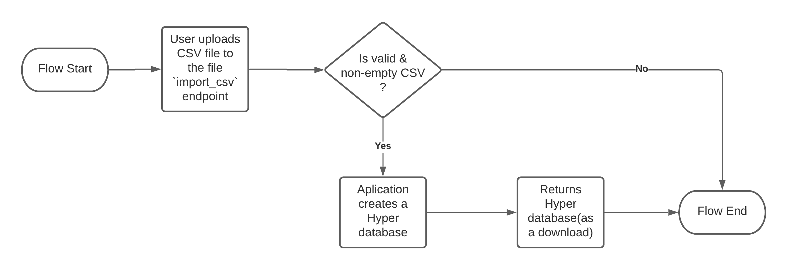
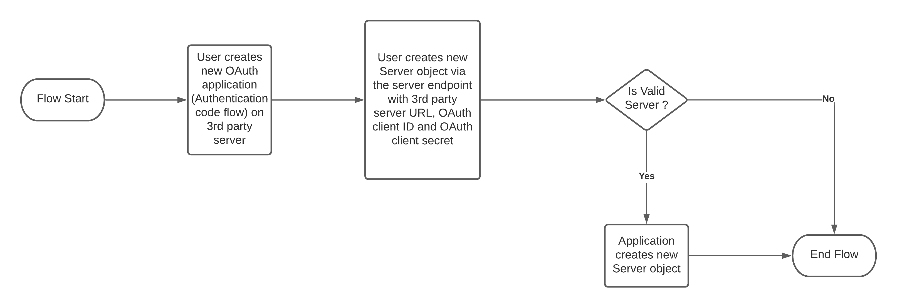
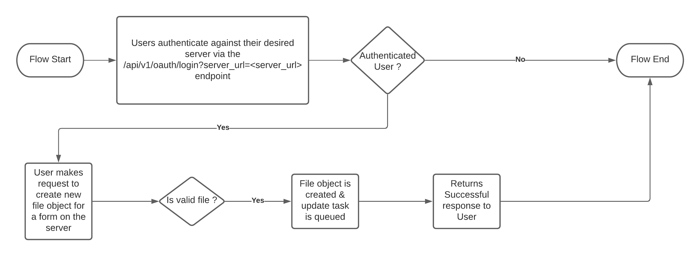

# Release Notes

This project has been funded by DG ECHO and implemented by Caritas Switzerland and the CARMA Consortium.

All release notes for this project will be documented in this file; this project follows [Semantic Versioning](https://semver.org/).

## v0.0.7 - 2022-01-20

### Bug fixes and improvements :bug:

- Add additional export configurations. PR [#27](https://github.com/onaio/duva/pull/27)

## v0.0.6 - 2021-10-25

### Bug fixes and improvements :bug:

- Add Health endpoint and export metrics using `starlette_exporter`. PR [#23](https://github.com/onaio/pull/23)
- Allow export settings to be configured via the API. PR [#24](https://github.com/onaio/pull/24)

## v0.0.5 - 2021-07-05

### Bug fixes and improvements :bug:

- Include question labels as headers & values instead of using the column name & value. PR [#20](https://github.com/onaio/duva/pull/20)

## v0.0.4 - 2021-06-03

### Bug fixes and improvements :bug:

- Ensure that deletions work as expected with S3. PR [#15](https://github.com/onaio/pull/15)

## v0.0.3 - 2021-05-12

### Bug fixes and improvements :bug:

- Fix issue raised when queuing new jobs. PR [#13](https://github.com/onaio/duva/pull/13)

## v0.0.2 - 2021-04-25

### Bug fixes and improvements :bug:

- Add sync lock mechanism and custom scheduler. PR [#7](https://github.com/onaio/duva/pull/7)

### Known Issues

- Fails to correctly store job ID for queued jobs. Issue [#11](https://github.com/onaio/duva/issues/11)

## v0.0.1 - 2021-03-15

This is the first release :confetti_ball:.

Project Breakdown: Duva is RESTful API that allows users to easily create & manage [Tableau Hyper](https://www.tableau.com/products/new-features/hyper) databases.

### Key Features as of v0.0.1:

- Supports automatic creation and updates of Hyper databases from an [OnaData](https://github.com/onaio/onadata) server; The application utilizes OnaDatas Export functionality to create and update the database.
- Supports creation of Hyper databases from a CSV File.

### Sample Flows:

#### One-off Hyper database creation from CSV File:

The application as mentioned above supports creation of a one-time Hyper database from a CSV File; These databases are not updated after creation.

This flow is ideal for one-off hyper database or for Servers where automatic creation & updates are not supported. *NB: As of v0.0.1 the application only supports OnaData servers.*

#### Automatic creation and updates of Hyper Databases for OnaData servers

In order for one to use this flow with a desired server, the user has to first register a new `Server` object. Which will be used to authenticate the application and users; allowing the application to pull data on behalf of the user on a scheduled basis in order to update the managed Hyper database.

Server registration flow(One-time flow for new servers):

After a new server is registered users from the registered server are now able to create
managed Hyper database files.

*During the creation of the managed hyper database, users can specify a Tableau server where the hyper database should be published too after every update of the hyper database. For more information on how to configure this please view the API Docs on a deployed instance of the application(/docs).*

### Known Limitations of v0.0.1

- The application currently uses session cookies to authenticate users; there are plans to phase out session cookies in favor of API Tokens. As of now users may need to clear the cookies in order to unauthenticate.
